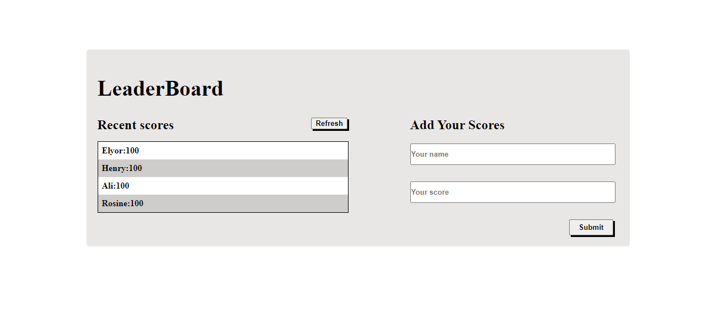

# Leaderboard

> This project is about set up a JavaScript project for the Leaderboard list app, using webpack and ES6 features.

Additional description of the project and its features.

## Built With

- JavaScript
- HTML, CSS
- Webpack

## Live Demo

[live demo](https://rawcdn.githack.com/elyor-doniyorov/leaderboard/04136cc7240163c17c24d5f143b8cdc6cb10ad0b/dist/index.html)

### Setup

1. Clone the repository to your computer by executing the command `https://github.com/elyor-doniyorov/leaderboard.git`

2. run: `code . ` to open code in your favorite text editor

3. run: `npm install`

4. run: `npm run start`

## Authors

👤 **Elyor Doniyorov**

- Github: [@elyor-doniyorov](https://github.com/elyor-doniyorov)
- LinkedIn: [@elyor-doniyorov](www.linkedin.com/in/elyor-doniyorov)

## 🤝 Contributing

Contributions, issues, and feature requests are welcome!

Feel free to check the [issues page](https://github.com/elyor-doniyorov/leaderboard/issues/2).

## Show your support

Give a ⭐️ if you like this project!

## Acknowledgments

Odin book library project at Java Script Module